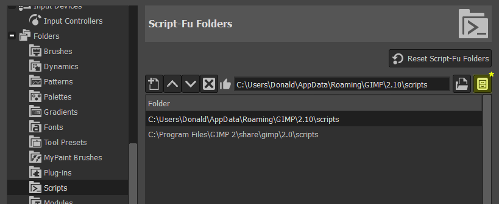
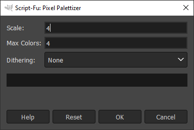
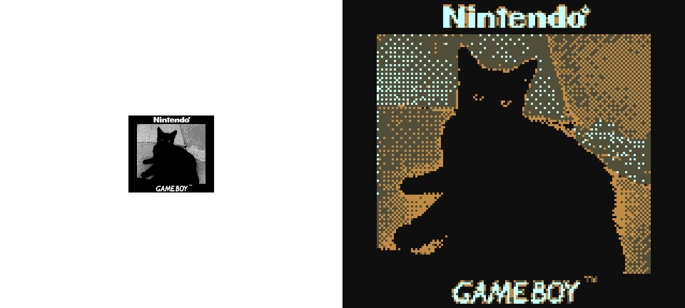
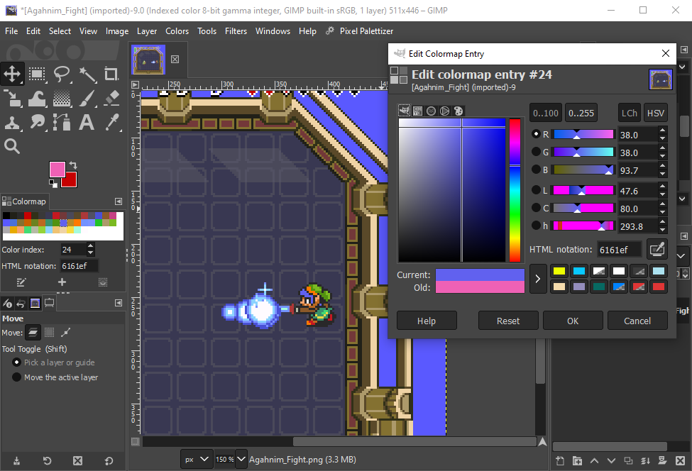
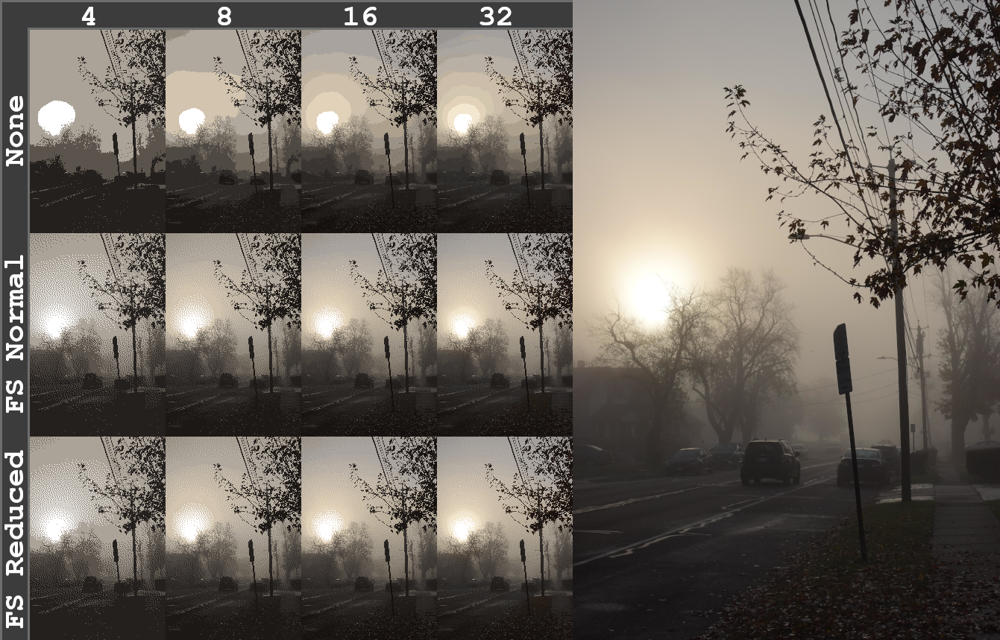

# Pixel Palettizer
Pixel Palettizer is a GIMP script that aims to streamline the process of scaling and color mapping pixel art to allow the user to quickly get from importing an image to modifying its palette.

## Installation
- Download "Pixel Palettizer.scm"
- In GIMP navigate to Edit > Preferences > Folders > Scripts
- Choose a folder in the list and click the button labeled "Show file location in file manager" **\***
- Place the script file in the scripts folder (.../scripts/Pixel Palettizer.scm)
- Back in GIMP navigate to Filters > Script-Fu > Refresh Scripts
- To open the colormap dock that you'll use to modify the palette navigate to Windows > Dockable Dialogs > Colormap

<p align="center">
  <picture>
    
  </picture>
</p>

## Options
- Scale: a numerical value to scale the height and width of the image by
- Max Colors: The maximum number of colors in the generated palette.
- Dithering:
  - None
  - Floyd-Steinberg (Normal)
  - Floyd-Steinberg (Reduced Bleeding)
  
<p align="center">
  <picture>
    
  </picture>
</p>
  
## Changing Default Settings
This script is designed to save you time so if you find yourself consistently using some values for **_Scale_** and **_Max Colors_** other than what are set by default you can easily change these defaults. Simply open the .scm file in a text editor and change the value in the quotation marks at the end of the following lines:

```
SF-VALUE "Scale" "4"
SF-VALUE "Max Colors" "4"
```
After changing these values save the file and refresh your scripts.

## Use Cases
### Colrizing Game Boy Camera Photos
Quickly editing the palette of Game Boy Camera photos and exporting them at a web-friendly scale was my original purpose in making this script and its default values are set with that in mind.

Recommended settings (default):
- Scale: 4
- Max colors: 4
- Dithering: None

<p align="center">
  <picture>
    
  </picture>
</p>

### Modifying Existing Pixel Art
Easily color map and modify existing pixel art. For best results use sharp pixel source images.

Recommended settings:
- Scale: 1
- Number of colors: 256
- Dithering: None

<p align="center">
  <picture>
    
  </picture>
</p>

### Pixelating Pictures
Give photos and other pictures a pixel art style. Note: this script applies scaling to the image first and then colormaps it.

Recommended settings:
- Scale: ≤1
- Number of colors: 4, 8, 16, 32, 64, . . .
- Dithering: None (heavy banding), FS Normal or Reduced (less banding)

<p align="center">
  <picture>
    
  </picture>
</p>
